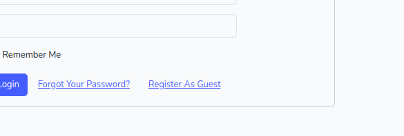
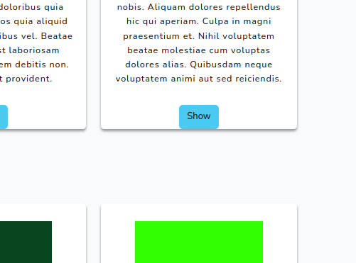
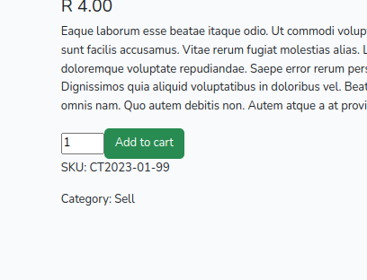
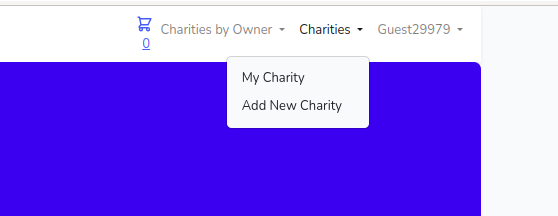
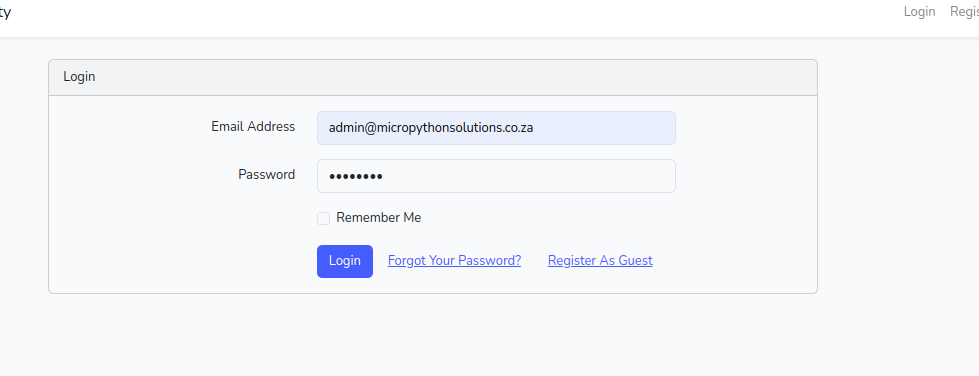
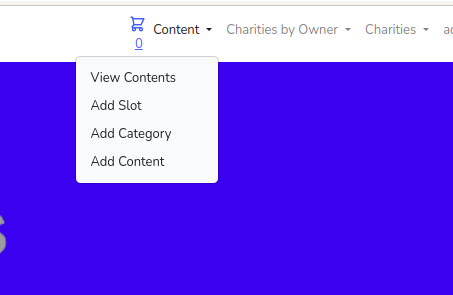
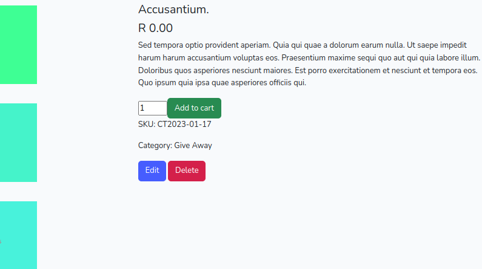

## About Laravel Open Market Charity

    Laravel : 10
    Bootstrap : 5

#### build with :

    composer create-project --prefer-dist laravel/laravel:^10.0 laravel-10-bootstrap5-vite

(Models are named wrong, started working on Product Cart: But charity was a better suit)

### Word of advice on updating Guest user, password is username on Guest accounts

Commands needed to get the applications to run

    git clone https://github.com/JBeggs/open-market-charity.git
    cd open-market-charity

    composer require laravel/ui

    nano .env

### Update these database settings

    DB_CONNECTION=mysql
    DB_HOST=127.0.0.1
    DB_PORT=3306
    DB_DATABASE=laravel_db
    DB_USERNAME=username
    DB_PASSWORD=password

## admin user

##### email    : admin@micropythonsolutions.co.za
##### password : password

### Install the database and seed some data for the front end

    php artisan migrate
    php artisan db:seed

### Install npm and run dev

    npm install && npm run dev
    php artisan serve

### Open browser

http://127.0.0.1:8000

Enjoy...

## Some features

### Guest Login

One click login for looking around

### Cart

Basic cart, Add to Cart and Remove

Click on show first 

Then Add to Cart

### Users Manage their Own Charities

### Charity Admin

Login

### Crude Content Management to edit banners

### Admin can edit all Charities and Delete them

